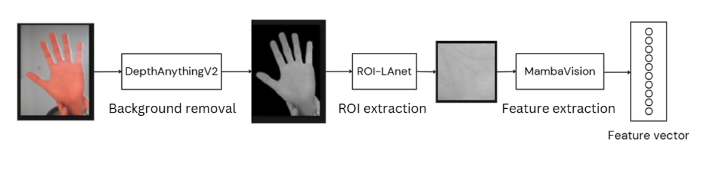
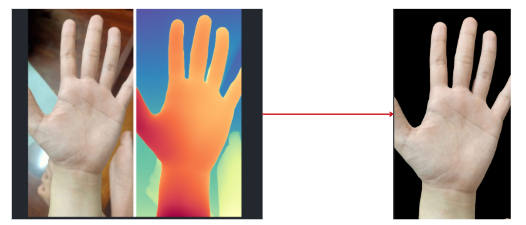
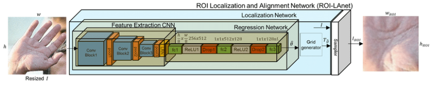
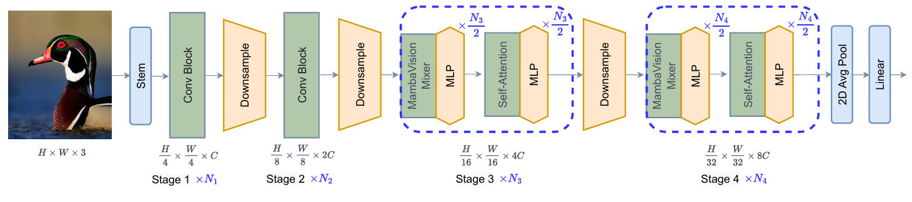
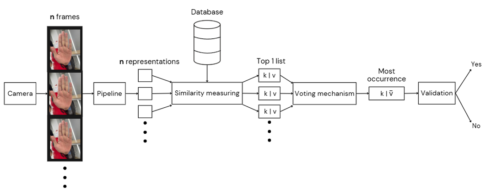

# Palm-Print-Identification-System

## Introduction

In community settings, such as universities, traditional biometric recognition systems that
require physical contact pose hygiene concerns and face scalability challenges in high-traffic areas, such
as lecture halls and classrooms. To address these limitations, we propose an AI-driven, contactless
palm print recognition system

demo video: https://www.youtube.com/watch?v=WLHxHGaZ14g

## System Overview

The platform features a system where student authentication is achieved through palm print biometric verification. Staff members are the primary users, handling functions like palm print registration, recognition, result retrieval, and log review. Administrators manage the system, overseeing staff accounts and maintaining student information.

## Proposed Palm Print Recognition Pipeline

### Here is the proposed pipeline:

- First stage is Background Removal - using DepthAnythingV2

- Second stage is ROI extraction - using ROI-LAnet

- Last stage is Feature extraction using MambaVision

### Background removal with DepthAnythingV2

We extract depth map of image using DepthAnythingV2, based on that depth map, we black out those pixel that are farther away from camera.

### ROI extraction with ROI-LAnet
 To improve the accuracy of the ROI extraction, we utilized a deep learning-based model
 called ROI-LAnet. This model is very efficient in extracting the palm region even when there is a noisy
 background. While ROI-LAnet is very effective in segmenting the palm from cluttered environments, it can
 still be vulnerable to extreme noise or highly variable background conditions

 

### Feature extraction with MambaVision
 For feature extraction task, we implement MambaVision, a  unique hybrid Mamba-Transformer backbone designed especially for vision applications.

  

### Verification and Authentication:

#### Authentication

Each image frame is compared with the registered images in the database to
calculate the similarity. Then, every frame is assigned to the closest matching class (top 1 matching) in the
database. A voting mechanism is used to determine the identity of the user, where the most frequent class
determines the identity.

#### Verification

The most occurrence user's average similarity and occurrence count is then used to calculate the score:

    score = (similarity + (occurrence_count / n)) / 2

where \( n \) is the size of the top 1 list.

## Experimental Results

**Table 1.** Comparison of Top 1 Accuracy and Voting (Identity) Accuracy between No Background Removal and Proposed Method on 15 frames both for registration and recognition.
| Method                | Experiment         | Top 1 ACC | Top Voting ACC |
|-----------------------|--------------------|-----------|----------------|
| No Background Removal | No Augmentation   | 72.65%    | 94.87%         |
|                       | Augmentation       | 56.08%    | 91.30%         |
| Proposed Method       | No Augmentation   | 85.44%    | 94.74%         |
|                       | Augmentation       | 75.07%    | 97.83%         |

 

**Table 2.** Comparison of Performance Metrics between No Background Removal and Proposed Method on 15 frames both for registration and recognition.
| Method                | Experiment         | ACC    | FRR    | FAR    | ERR    |
|-----------------------|--------------------|--------|--------|--------|--------|
| No Background Removal | No Augmentation   | 77.24% | 20.51% | 25.00% | 22.75% |
|                       | Augmentation       | 80.43% | 34.78% | 4.34%  | 19.56% |
| Proposed Method       | No Augmentation   | 90.79% | 2.63%  | 15.78% | 9.21%  |
|                       | Augmentation       | 90.21% | 10.87% | 8.69%  | 9.78%  |

