# Palm-Print-Identification-System

## Introduction

In community settings, such as universities, traditional biometric recognition systems that
require physical contact pose hygiene concerns and face scalability challenges in high-traffic areas, such
as lecture halls and classrooms. To address these limitations, we propose an AI-driven, contactless
palm print recognition system

demo video: https://www.youtube.com/watch?v=WLHxHGaZ14g

## System Overview

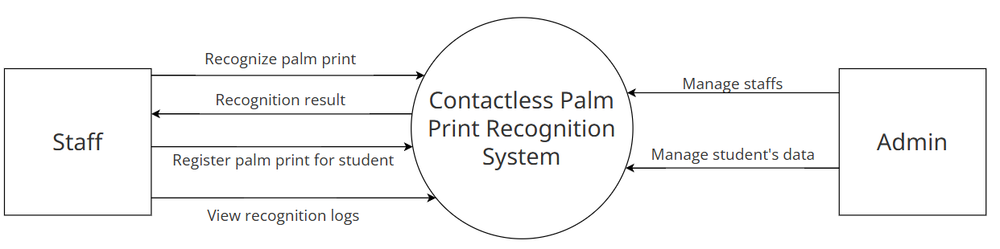
*Figure 5: Palm Print Recognition System Context Diagram.*

The platform features a system where student authentication is achieved through palm print biometric verification. Staff members are the primary users, handling functions like palm print registration, recognition, result retrieval, and log review. Administrators manage the system, overseeing staff accounts and maintaining student information.

## Application Detail Flow

### Registration Detail Flow

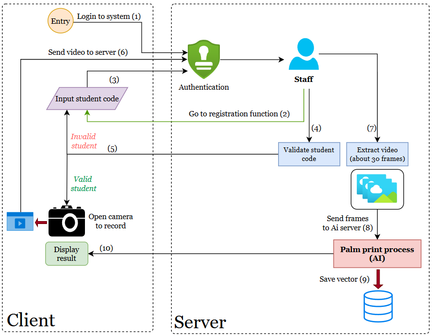
*Figure 8: Registration detail flow.*

Figure 8 illustrates the detailed registration process for a palm print authentication system, divided between
the client and the server sides. The process follows a numbered sequence (1-10):
1. The process begins with a system login.
2. The staff initiates the registration function.
3. A student code is input on the client side.
4. The staff validates the student code.
5. If the student code is invalid, it returns to the input step.
6. The video is sent to the server for processing.
7. The system extracts approximately 30 frames from the video.
8. These frames are sent to an AI server.
9. The AI processes the palm print and saves the vector data to a database.
10. Finally, the result is displayed back on the client side.

### Recognition Detail Flow

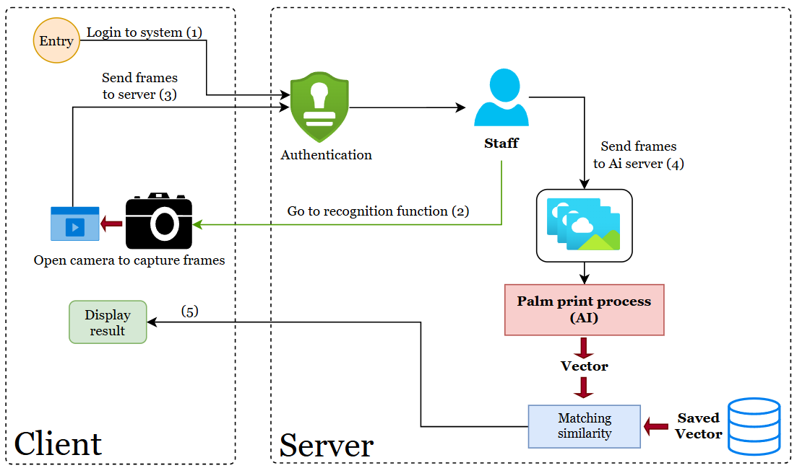
*Figure 9: Recognition detail flow.*

Figure 9 illustrates the recognition process for a palm print authentication system, divided between client-
server sides. The process follows a numbered sequence (1-5):
1. The process begins with logging into the system.
2. The staff activates the recognition function.
3. The captured frames from the camera are sent to the server.
4. These frames are forwarded to the AI server for processing.  
– An AI processing component for palm print analysis.  
– Vector extraction from the palm print.  
– A matching system that compares the extracted vector with saved vectors in the database.  
– A database storing previously registered palm print vectors.
5. Finally, the recognition result is displayed on the client side.

## Application User Interface and Features

### Authentication and Authorization
The Figure 10 illustrates the login screen that serves to authenticate users and assign permissions when logging in to use the system. Staff accounts will be strictly managed by the admin. When logging in, an account with the ADMIN role will be redirected to the main screen of the admin, illustrated in Figure 11. In addition, an account with the STAFF role will be redirected to the main screen of the staff, as shown Figure 12.
  
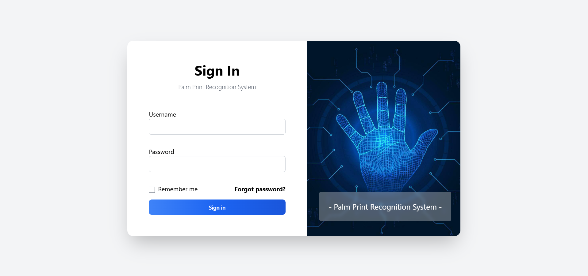
*Figure 10: The login screen.*
  

  

    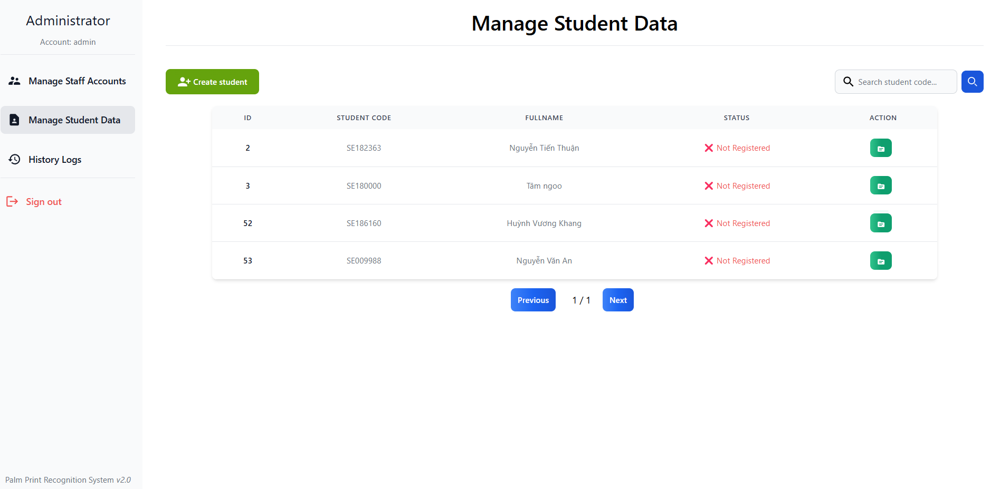
    
<em>Figure 11: Admin Dashboard.</em>

  

  

    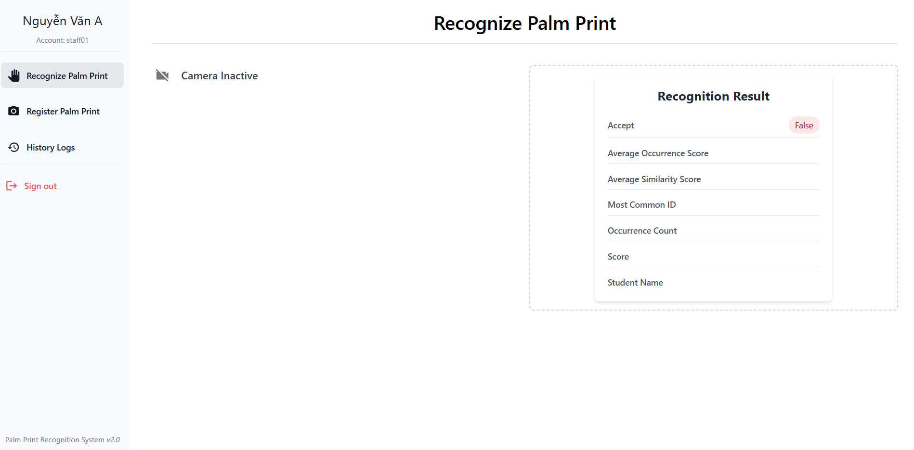
    
<em>Figure 12: Staff Dashboard.</em>

  

### Palm Print Registration
The Figure 13 illustrates the first step of registration, the staff must supply a student code before registering palm print. Staffs begin by entering a student code in the provided text box, as shown with the example SE182363. After entering the code, they click the "Check" button, which verifies the validity of the student in the system. A green notification, such as "Student is valid!" in this instance, confirms successful validation. This step ensures that only authorized students can proceed to the next stage of palm print registration, maintaining the integrity of the system.
  
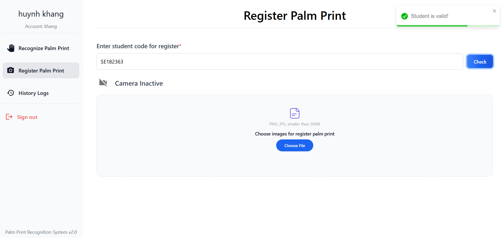
*Figure 13: Entering the student code for validation.*  
  
In the second step of the Register Palm Print process, illustrated in Figure 14, the system activates the camera to capture the user's palm image for registration. Initially, the interface displays a status of "Waiting for hand detection" alongside a spinning loader, indicating that the system is scanning for a hand to appear in the camera's view. Once a hand is detected, a notification appears, such as "Hand detected for 1.6 seconds," confirming the detection process. The system simultaneously records the palm image, as indicated by the red "Recording..." status at the top. This step ensures the successful capture of a clear and valid palm image using the connected camera, as seen in the sample image. The process is essential for accurately registering the palm print data into the system. After detecting the hand about 3 seconds, the video will be sent to server to process and go to the next step, as shown in Figure 15.
  
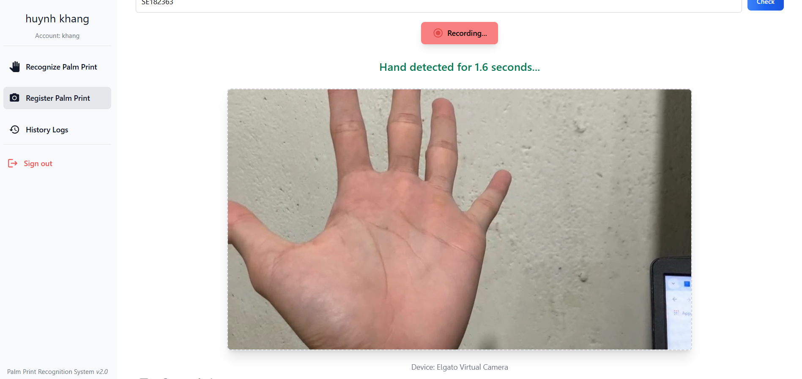
*Figure 14: Activating the camera to capture the palm image.*    
  
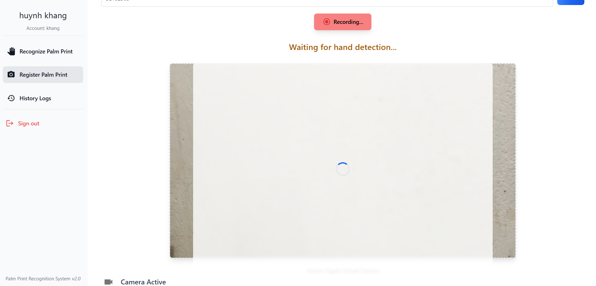
*Figure 15: Sending the video to the server after hand detection.*
  
In step 4 of the Register Palm Print process, illustrated in Figure 16, the system extracts approximately 30 frames from the video recorded in the previous step. These frames represent individual still images of the user's palm, ensuring a variety of angles and clarity for accurate palm print data registration. The extracted frames are displayed in a grid format, allowing users to preview the images, the staff can choose images which are substandard such as blurry, poor quality photos, eliminate them before sending them to server to handle the next step. This step is critical for choosing the most suitable frames to ensure the quality and reliability of the palm print data being registered.
  
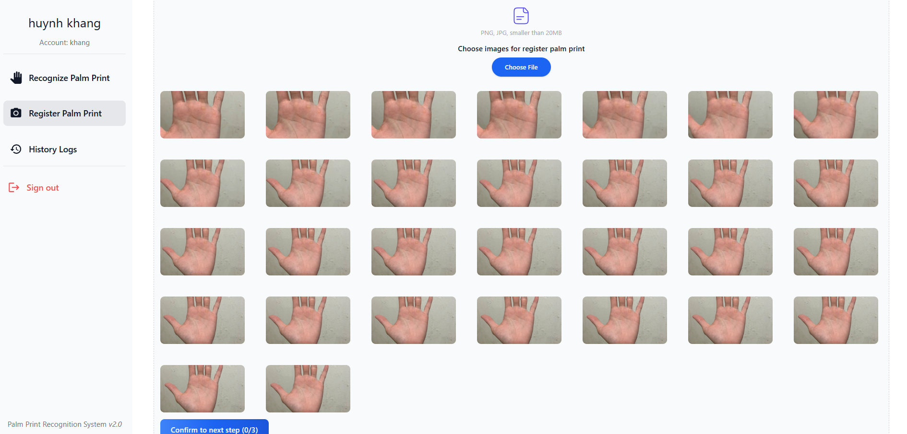
*Figure 16: Extracting frames from the recorded video.*  

In step 5 of the Register Palm Print process, as shown in Figure 17, the system processes the previously extracted frames by removing the background, isolating the palm area. This step enhances the clarity and focus of the palm images by eliminating any unnecessary elements from the frame, leaving only the hand against a clean, black background. The processed images are displayed in a grid format for the user to review. As in the previous step, the staff can choose image to eliminate these poor quality background cut photos ensure accurate and reliable palm print data by emphasizing only the relevant features of the hand.

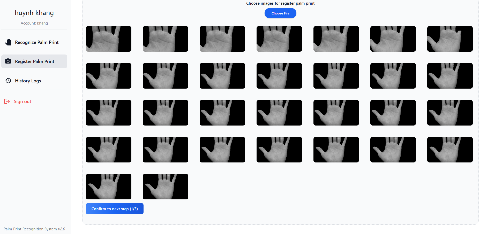
*Figure 17: Processing frames by removing the background.*  

In step 6 of the Register Palm Print process, as shown in Figure 18, the system performs Region of Interest (ROI) cutting to isolate the detailed palm print patterns from the selected images. This step extracts only the core area of the palm print, ensuring the removal of any irrelevant portions of the hand or background. The processed images display the intricate palm lines and ridges, making them suitable for biometric analysis. After confirm to next step, if no any error or exception from server, the screen will display "Register palm print successfully" like Figure 19.
  
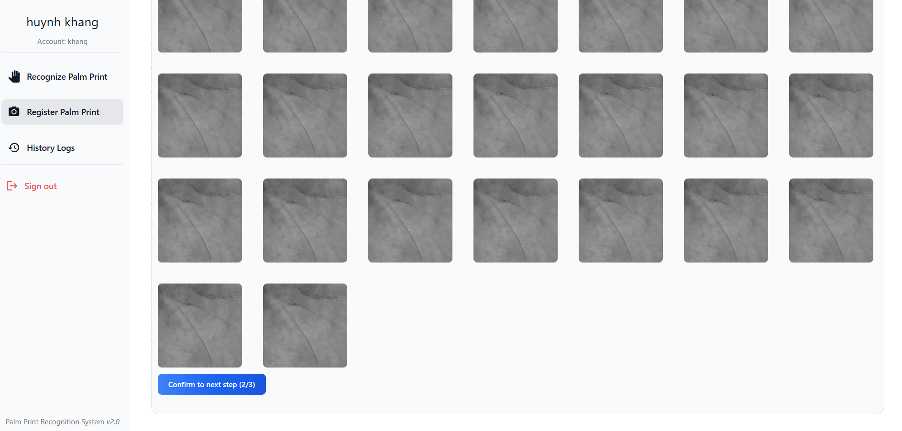
*Figure 18: Performing Region of Interest (ROI) cutting.*
  
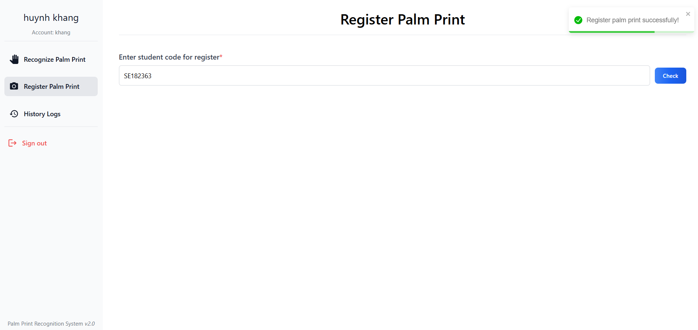
*Figure 19: Successfull palm print registration.*  
  

    
### Palm Print Recognition

In the first step of the Recognize Palm Print process, illustrated in Figure 20, the system begins by activating the camera and detecting the presence of a hand. As shown in the image, the system is currently recording and has successfully detected the user's hand. The detected hand is displayed in real-time to ensure proper positioning for palm print recognition. This step is the first for capturing a clear palm image, which is then analyzed to match against stored records in the system. Users must ensure proper hand alignment and clarity to achieve accurate recognition results. After detecting the hand about 3 seconds, all frames are captured will sent to server to recognize identity.
  
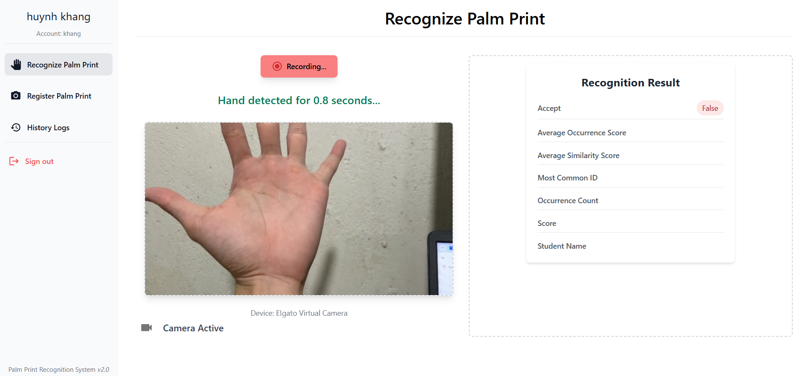
*Figure 20: Capturing frames and sending them to the server for identity recognition.*
  
In the final step of the Recognize Palm Print process, as shown in Figure 21, the system successfully completes the recognition and displays the results. The Recognition Result panel on the right confirms that the recognition was successful with the ``Accept'' status marked as ``True''. Key metrics such as the Average Occurrence Score (0.93) and Average Similarity Score (0.93) indicate a high match accuracy. The Most Common ID identified is SE182363, and the Occurrence Count is 28, suggesting consistent matches with the stored data. Additionally, the recognition score achieved is 0.93. The recognized user is displayed as Nguyen Tien Thuan, confirming that the palm print corresponds to this individual. This step validates the successful recognition and identification of the user based on the palm print data.
  
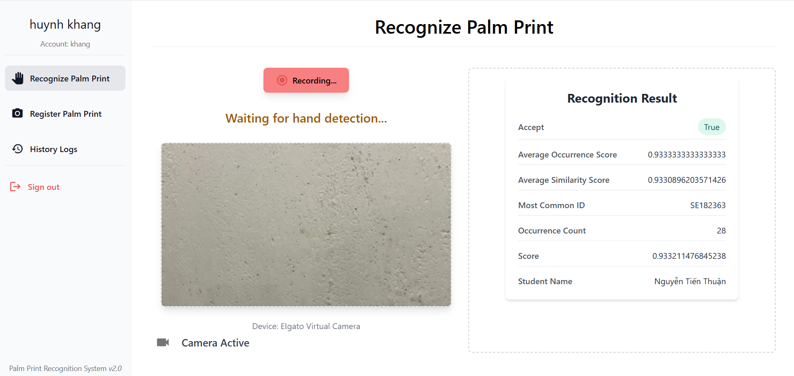
*Figure 21: Confirming the recognized user based on the palm print data.* 

<!-- ----------------------------------------------------- -->

## Proposed Palm Print Recognition Pipeline

### Here is the proposed pipeline:

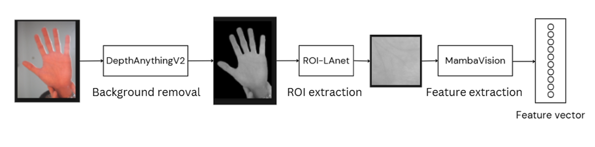

- First stage is Background Removal - using DepthAnythingV2

- Second stage is ROI extraction - using ROI-LAnet

- Last stage is Feature extraction using MambaVision

### Background removal with DepthAnythingV2

We extract depth map of image using DepthAnythingV2, based on that depth map, we black out those pixel that are farther away from camera.

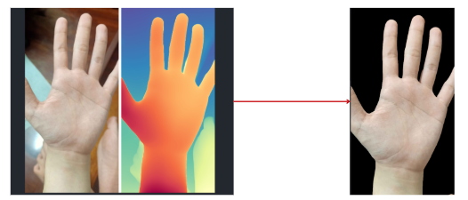

### ROI extraction with ROI-LAnet
 To improve the accuracy of the ROI extraction, we utilized a deep learning-based model
 called ROI-LAnet. This model is very efficient in extracting the palm region even when there is a noisy
 background. While ROI-LAnet is very effective in segmenting the palm from cluttered environments, it can
 still be vulnerable to extreme noise or highly variable background conditions

 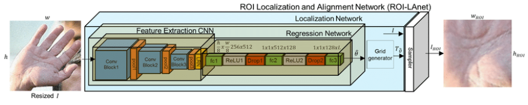

### Feature extraction with MambaVision
 For feature extraction task, we implement MambaVision, a  unique hybrid Mamba-Transformer backbone designed especially for vision applications.

  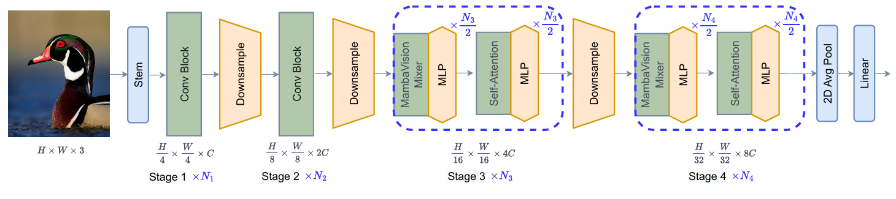

### Verification and Authentication:

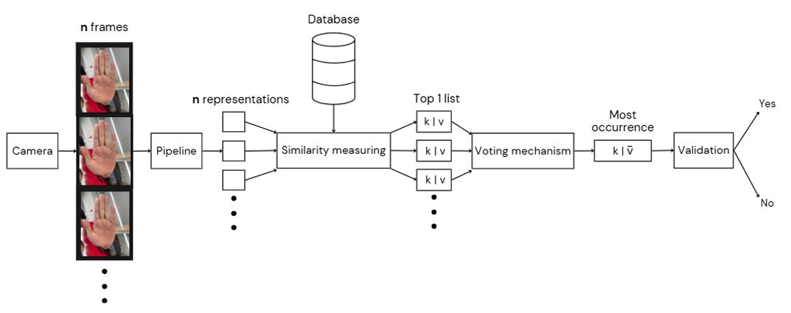

#### Authentication

Each image frame is compared with the registered images in the database to
calculate the similarity. Then, every frame is assigned to the closest matching class (top 1 matching) in the
database. A voting mechanism is used to determine the identity of the user, where the most frequent class
determines the identity.

#### Verification

The most occurrence user's average similarity and occurrence count is then used to calculate the score:

    score = (similarity + (occurrence_count / n)) / 2

where \( n \) is the size of the top 1 list.

## Experimental Results

**Table 1.** Comparison of Top 1 Accuracy and Voting (Identity) Accuracy between No Background Removal and Proposed Method on 15 frames both for registration and recognition.
| Method                | Experiment         | Top 1 ACC | Top Voting ACC |
|-----------------------|--------------------|-----------|----------------|
| No Background Removal | No Augmentation   | 72.65%    | 94.87%         |
|                       | Augmentation       | 56.08%    | 91.30%         |
| Proposed Method       | No Augmentation   | 85.44%    | 94.74%         |
|                       | Augmentation       | 75.07%    | 97.83%         |

 

**Table 2.** Comparison of Performance Metrics between No Background Removal and Proposed Method on 15 frames both for registration and recognition.
| Method                | Experiment         | ACC    | FRR    | FAR    | ERR    |
|-----------------------|--------------------|--------|--------|--------|--------|
| No Background Removal | No Augmentation   | 77.24% | 20.51% | 25.00% | 22.75% |
|                       | Augmentation       | 80.43% | 34.78% | 4.34%  | 19.56% |
| Proposed Method       | No Augmentation   | 90.79% | 2.63%  | 15.78% | 9.21%  |
|                       | Augmentation       | 90.21% | 10.87% | 8.69%  | 9.78%  |

