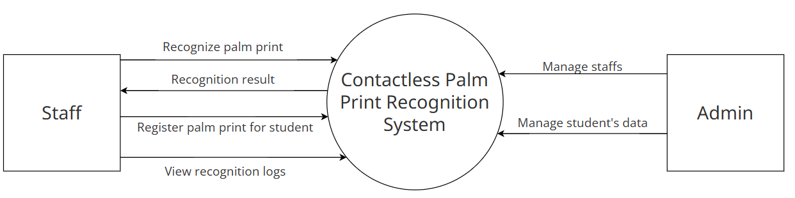
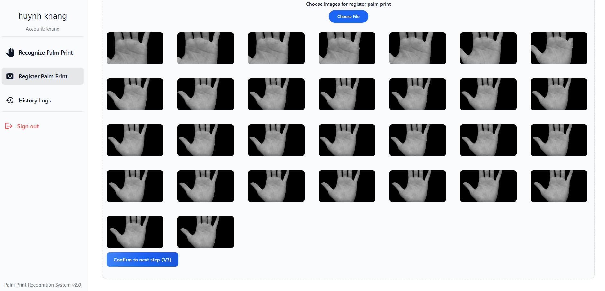
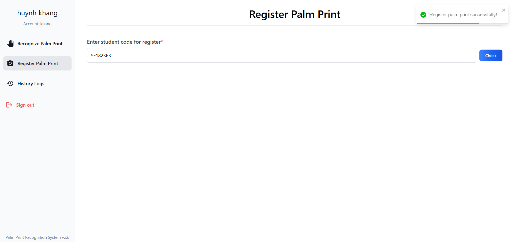

# Palm-Print-Identification-System

## Introduction

In community settings, such as universities, traditional biometric recognition systems that
require physical contact pose hygiene concerns and face scalability challenges in high-traffic areas, such
as lecture halls and classrooms. To address these limitations, we propose an AI-driven, contactless
palm print recognition system

demo video: https://www.youtube.com/watch?v=WLHxHGaZ14g

## System Overview

*Figure 5: Palm Print Recognition System Context Diagram.*

The platform features a system where student authentication is achieved through palm print biometric verification. Staff members are the primary users, handling functions like palm print registration, recognition, result retrieval, and log review. Administrators manage the system, overseeing staff accounts and maintaining student information.

## Application Detail Flow

### Registration Detail Flow

*Figure 8: Registration detail flow.*

Figure 8 illustrates the detailed registration process for a palm print authentication system, divided between
the client and the server sides. The process follows a numbered sequence (1-10):
1. The process begins with a system login.
2. The staff initiates the registration function.
3. A student code is input on the client side.
4. The staff validates the student code.
5. If the student code is invalid, it returns to the input step.
6. The video is sent to the server for processing.
7. The system extracts approximately 30 frames from the video.
8. These frames are sent to an AI server.
9. The AI processes the palm print and saves the vector data to a database.
10. Finally, the result is displayed back on the client side.

### Recognition Detail Flow

*Figure 9: Recognition detail flow.*

Figure 9 illustrates the recognition process for a palm print authentication system, divided between client-
server sides. The process follows a numbered sequence (1-5):
1. The process begins with logging into the system.
2. The staff activates the recognition function.
3. The captured frames from the camera are sent to the server.
4. These frames are forwarded to the AI server for processing.  
– An AI processing component for palm print analysis.  
– Vector extraction from the palm print.  
– A matching system that compares the extracted vector with saved vectors in the database.  
– A database storing previously registered palm print vectors.
5. Finally, the recognition result is displayed on the client side.

## Application User Interface and Features

### Authentication and Authorization

*Figure 10: The login screen.*

  

    
    
<em>Figure 11: Admin Dashboard.</em>

  

  

    
    
<em>Figure 12: Staff Dashboard.</em>

  

The login screen (Figure 10) authenticates users and assigns permissions. Admin accounts are managed by the admin. ADMIN role accounts are redirected to the admin main screen (Figure 11), while STAFF role accounts are redirected to the staff main screen (Figure 12).

### Palm Print Registration

*Figure 13: Entering the student code for validation.*  

In the first step, the staff must supply a student code before registering a palm print. They enter the code and click the "Check" button to verify the student's validity. A green notification confirms successful validation.

*Figure 14: Activating the camera to capture the palm image.*    

In the second step, the system activates the camera to capture the user's palm image. The interface displays a status of "Waiting for hand detection" and a notification appears once a hand is detected. The system records the palm image, ensuring a clear and valid capture.

*Figure 15: Sending the video to the server after hand detection.*

*Figure 16: Extracting frames from the recorded video.*  

In step 4, the system extracts approximately 30 frames from the recorded video. These frames are displayed in a grid format for preview, allowing the staff to eliminate substandard images before sending them to the server.

*Figure 17: Processing frames by removing the background.*  

In step 5, the system processes the frames by removing the background, isolating the palm area. The processed images are displayed for review, and the staff can eliminate poor quality photos.

*Figure 18: Performing Region of Interest (ROI) cutting.*

*Figure 19: Successful palm print registration.*  

In step 6, the system performs Region of Interest (ROI) cutting to isolate detailed palm print patterns. The processed images display intricate palm lines and ridges, suitable for biometric analysis. If no errors occur, the screen will display "Register palm print successfully."

### Palm Print Recognition

*Figure 20: Activating the camera and detecting the presence of a hand.*

*Figure 21: Capturing frames and sending them to the server for identity recognition.*

*Figure 22: Displaying the recognition results with key metrics.* 

In the first step, the system activates the camera and detects the presence of a hand. The detected hand is displayed in real-time to ensure proper positioning for palm print recognition. Users must ensure proper hand alignment and clarity for accurate recognition results. After detecting the hand for about 3 seconds, all captured frames are sent to the server for identity recognition.

*Figure 23: Confirming the recognized user based on the palm print data.* 

In the final step, the system completes the recognition and displays the results. The Recognition Result panel confirms the recognition was successful with an "Accept" status marked as "True". Key metrics such as the Average Occurrence Score (0.93) and Average Similarity Score (0.93) indicate high match accuracy. The recognized user is displayed as Nguyen Tien Thuan, confirming the palm print corresponds to this individual.

<!-- ----------------------------------------------------- -->

## Proposed Palm Print Recognition Pipeline

### Here is the proposed pipeline:

- First stage is Background Removal - using DepthAnythingV2

- Second stage is ROI extraction - using ROI-LAnet

- Last stage is Feature extraction using MambaVision

### Background removal with DepthAnythingV2

We extract depth map of image using DepthAnythingV2, based on that depth map, we black out those pixel that are farther away from camera.

### ROI extraction with ROI-LAnet
 To improve the accuracy of the ROI extraction, we utilized a deep learning-based model
 called ROI-LAnet. This model is very efficient in extracting the palm region even when there is a noisy
 background. While ROI-LAnet is very effective in segmenting the palm from cluttered environments, it can
 still be vulnerable to extreme noise or highly variable background conditions

 

### Feature extraction with MambaVision
 For feature extraction task, we implement MambaVision, a  unique hybrid Mamba-Transformer backbone designed especially for vision applications.

  

### Verification and Authentication:

#### Authentication

Each image frame is compared with the registered images in the database to
calculate the similarity. Then, every frame is assigned to the closest matching class (top 1 matching) in the
database. A voting mechanism is used to determine the identity of the user, where the most frequent class
determines the identity.

#### Verification

The most occurrence user's average similarity and occurrence count is then used to calculate the score:

    score = (similarity + (occurrence_count / n)) / 2

where \( n \) is the size of the top 1 list.

## Experimental Results

**Table 1.** Comparison of Top 1 Accuracy and Voting (Identity) Accuracy between No Background Removal and Proposed Method on 15 frames both for registration and recognition.
| Method                | Experiment         | Top 1 ACC | Top Voting ACC |
|-----------------------|--------------------|-----------|----------------|
| No Background Removal | No Augmentation   | 72.65%    | 94.87%         |
|                       | Augmentation       | 56.08%    | 91.30%         |
| Proposed Method       | No Augmentation   | 85.44%    | 94.74%         |
|                       | Augmentation       | 75.07%    | 97.83%         |

 

**Table 2.** Comparison of Performance Metrics between No Background Removal and Proposed Method on 15 frames both for registration and recognition.
| Method                | Experiment         | ACC    | FRR    | FAR    | ERR    |
|-----------------------|--------------------|--------|--------|--------|--------|
| No Background Removal | No Augmentation   | 77.24% | 20.51% | 25.00% | 22.75% |
|                       | Augmentation       | 80.43% | 34.78% | 4.34%  | 19.56% |
| Proposed Method       | No Augmentation   | 90.79% | 2.63%  | 15.78% | 9.21%  |
|                       | Augmentation       | 90.21% | 10.87% | 8.69%  | 9.78%  |

